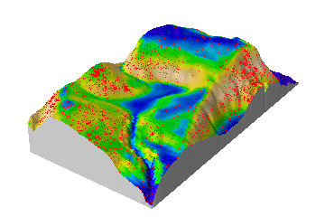
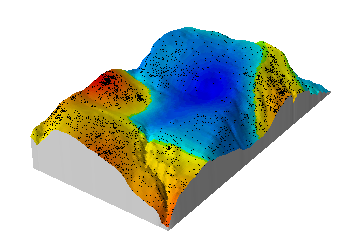

|  |  |

## Welcome to the `spatstat` website

`spatstat` is an R package for spatial statistics with a strong focus
on analysing spatial point patterns in 2D (with some support for 3D
and very basic support for space-time).

Go to the [news page](news.html) to read about the latest release
of `spatstat` or [read the full release
notes](releasenotes/index.html) for more details.

Usually you would just want to install `spatstat` directly from
`R`. If you need the source code go to [CRAN][1] or [GitHub][2] (which
also contains a development version) as explained at the [download
page](download.html).

If you are new to `spatstat` take a look at the [resources
page](resources.html) for places to get started. For help take a look
at the [help page](help.html) and check out the [FAQ page](FAQ.html)
to see if somebody else has had a similar problem.

[1]: http://www.cran.r-project.org/web/packages/spatstat/index.html

[2]: https://github.com/spatstat/spatstat

